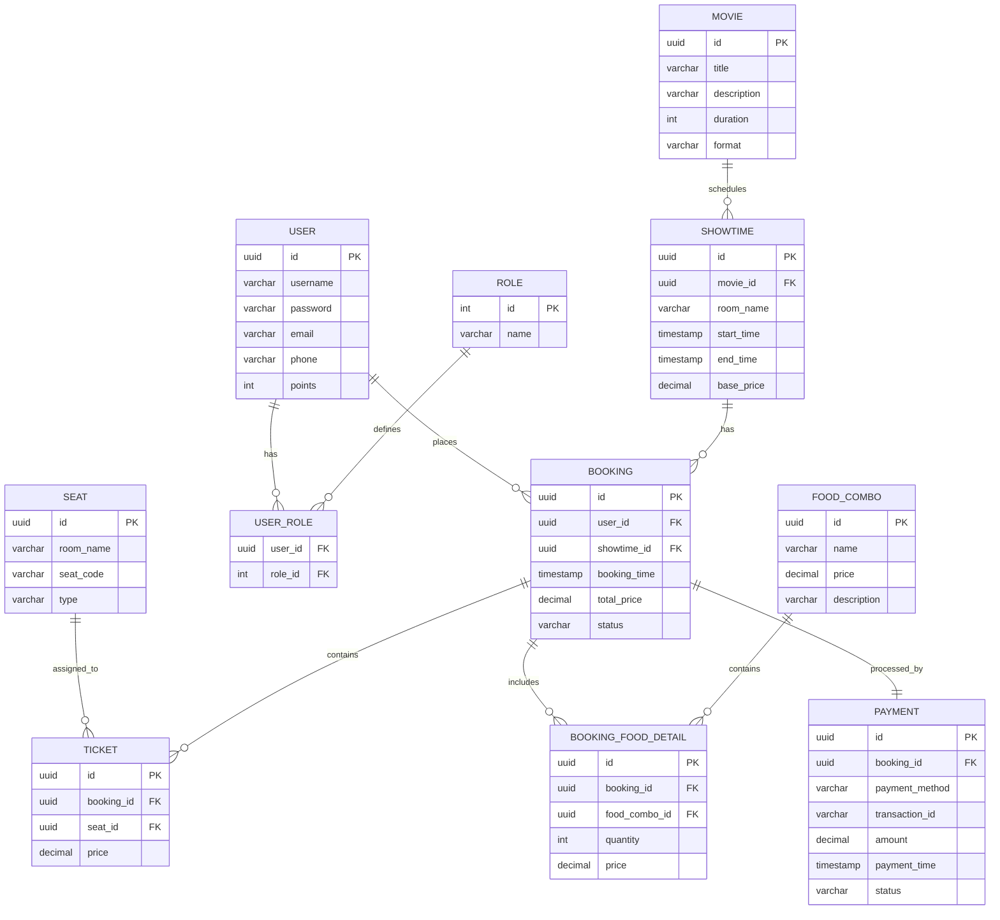

# BÁO CÁO KẾT QUẢ HACKATHON AI - ĐỀ 03

---

## PHẦN 1: TÁI CẤU TRÚC HỆ THỐNG ĐỂ DỄ MỞ RỘNG

### 1. Mục tiêu kỹ thuật
* Áp dụng **Strategy Pattern** nhằm tách biệt hoàn toàn thuật toán tính giá của từng loại ghế (Normal, VIP, Sweetbox). Khi thêm loại ghế mới, ta chỉ cần tạo thêm class Strategy mới mà không làm thay đổi hay ảnh hưởng đến logic tính giá cốt lõi.
* Áp dụng **Strategy kết hợp Registry Pattern** để quản lý mã giảm giá (Student, Festival). Logic áp dụng mã giảm giá được chuyển dịch từ các câu lệnh rẽ nhánh `if-else` lồng nhau phức tạp sang việc đăng ký và tra cứu chiến lược giảm giá linh hoạt trong một Registry.
* Tách biệt cơ chế tích lũy điểm thành viên (`LoyaltyPointsCalculator`) và cơ chế gửi thông báo (`NotificationService`) thành các interface riêng biệt, giúp dễ dàng mở rộng hoặc thay thế phương thức nghiệp vụ trong tương lai.
* Sử dụng **Dependency Injection** để đưa các thành phần phụ thuộc vào `TicketingService`, giảm thiểu liên kết chặt chẽ (tight coupling) và tăng tính bảo trì của hệ thống.

### 2. Lịch sử Prompt (Prompt Chain)
* **Prompt 1 (Phân tích lỗi thiết kế ban đầu):** 
  *"Tôi có một class `TicketingService` xử lý đặt vé xem phim. Hiện tại class này đang ôm đồm nhiều logic từ tính giá theo loại ghế, giảm giá, tích điểm đến gửi thông báo. Điều này vi phạm nguyên lý SOLID nào và bạn đề xuất hướng tái cấu trúc bằng Design Pattern nào để đảm bảo sau này thêm loại ghế hay mã giảm giá mới mà không cần sửa code cũ?"*
* **Prompt 2 (Thiết kế Strategy cho tính giá ghế):** 
  *"Hãy hiện thực hóa cơ chế tính giá ghế sử dụng Strategy Pattern. Hãy thiết kế sao cho việc thêm các loại ghế VIP, SWEETBOX hay NORMAL độc lập hoàn toàn với lớp tính toán giá cốt lõi."*
* **Prompt 3 (Thiết kế Strategy cho mã giảm giá & Tiện ích):** 
  *"Hãy tiếp tục viết code cho phần giảm giá sử dụng Strategy kết hợp Registry Pattern để tra cứu mã giảm giá linh hoạt. Thiết kế thêm các interface cho việc tính điểm loyalty và gửi thông báo."*
* **Prompt 4 (Hợp nhất mã nguồn vào một file duy nhất):** 
  *"Hãy giúp tôi gom toàn bộ interface, strategy, registry, service đã viết vào trong file `TicketingService.java` dưới dạng các non-public classes. Đồng thời cung cấp constructor mặc định khởi tạo sẵn các strategy gốc để đảm bảo chương trình kiểm thử bên ngoài vẫn chạy bình thường khi khởi tạo bằng `new TicketingService()` và đổi package thành `com.rikkei.refactoring`."*

### 3. Phân tích lỗi AI
* **Lỗi chưa tối ưu ở lần sinh đầu tiên:**
  Interface `SeatPricingStrategy` ban đầu được đề xuất nhận trực tiếp thực thể `Seat` làm tham số: `double calculatePrice(ShowTime show, Seat seat);`. Điều này tạo ra sự phụ thuộc chặt (tight coupling) giữa Strategy tính giá với lớp Model `Seat`. Nếu sau này lớp `Seat` thay đổi cấu trúc, Strategy tính giá cũng sẽ bị ảnh hưởng và phải chỉnh sửa.
* **Cách khắc phục:**
  Điều chỉnh chữ ký phương thức chỉ nhận giá trị cơ bản: `double calculatePrice(double basePrice);`. Lớp dịch vụ trung gian sẽ chịu trách nhiệm lấy `basePrice` và `type` từ các đối tượng Model để truyền vào Strategy. Điều này giúp các Strategy hoàn toàn độc lập với cấu trúc của `Seat` và `ShowTime`.

---

## PHẦN 2: DEBUGGING BẢO MẬT VÀ XỬ LÝ LỖI HỆ THỐNG

### 1. Mục tiêu kỹ thuật
* Tách biệt cơ chế xử lý lỗi xác thực ở tầng Filter ra khỏi logic nghiệp vụ của bộ lọc JWT bằng cách sử dụng **`AuthenticationEntryPoint`** của Spring Security.
* Đảm bảo mọi ngoại lệ liên quan đến xác thực (như token sai chữ ký, hết hạn, hoặc không đúng định dạng) đều được bắt tập trung và trả về một định dạng JSON đồng nhất: 
  ```json
  {"error": "UNAUTHORIZED", "message": "..."}
  ```
* Thiết lập HTTP Status `401 Unauthorized` thay vì để ngoại lệ lan truyền lên Servlet Container gây lỗi crash `500 Internal Server Error`.

#### Tại sao không nên dùng try-catch và ghi đè response trực tiếp trong Filter?
* **Vi phạm nguyên lý đơn nhiệm (SRP):** Filter sẽ phải kiêm nhiệm cả nhiệm vụ xác thực lẫn định dạng dữ liệu lỗi của response.
* **Trùng lặp mã nguồn:** Nếu ứng dụng sử dụng thêm các Filter xác thực khác, logic bắt ngoại lệ và định dạng JSON lỗi sẽ phải viết lại tại nhiều nơi.
* **Mất tính linh hoạt:** Việc sử dụng cấu hình tập trung qua `AuthenticationEntryPoint` giúp Spring Security dễ dàng thay đổi cấu hình bảo mật hoặc thay đổi định dạng lỗi mà không cần chỉnh sửa mã nguồn hoạt động của từng Filter.

### 2. Lịch sử Prompt (Prompt Chain)
* **Prompt 1 (Phân tích lỗi HTTP 500 tầng Filter):** 
  *"Tại sao khi JWT ném ra `SignatureException` trong `OncePerRequestFilter`, Spring Boot lại trả về HTTP 500 thay vì HTTP 401 mặc dù tôi đã cấu hình `@ControllerAdvice`? Làm thế nào để bắt lỗi này một cách tập trung chuẩn Spring Security?"*
* **Prompt 2 (Hiện thực lớp xử lý lỗi tập trung):** 
  *"Hãy viết mã nguồn cho `JwtAuthenticationEntryPoint` trả về mã lỗi HTTP 401 với định dạng JSON `{"error": "UNAUTHORIZED", "message": "..."}` và viết class ngoại lệ `JwtAuthenticationException`."*
* **Prompt 3 (Cấu hình tích hợp vào bộ lọc JWT):** 
  *"Hãy sửa lại lớp `JwtAuthenticationFilter` để bắt `SignatureException`, `ExpiredJwtException`, `MalformedJwtException` và chuyển tiếp cho `JwtAuthenticationEntryPoint` xử lý."*

### 3. Phân tích lỗi AI
* **Lỗi chưa tối ưu ở lần sinh code đầu tiên:**
  AI đề xuất giải pháp tạo thêm một Filter phụ nằm ngoài cùng chuỗi bộ lọc để bọc toàn bộ Filter Chain bằng khối `try-catch` lớn. Điều này gây dư thừa tài nguyên hệ thống do phát sinh thêm Filter không cần thiết và đi lệch khỏi cơ chế xử lý lỗi xác thực chuẩn có sẵn của Spring Security.
* **Cách khắc phục:**
  Yêu cầu AI loại bỏ Filter bọc ngoài, cấu hình trực tiếp `AuthenticationEntryPoint` vào `HttpSecurity` của chuỗi cấu hình bảo mật `SecurityFilterChain`, đồng thời inject trực tiếp `JwtAuthenticationEntryPoint` vào `JwtAuthenticationFilter` để ủy quyền xử lý lỗi ngay khi bắt được exception.

---

## PHẦN 3: PHÂN TÍCH VÀ THIẾT KẾ HỆ THỐNG VỚI AI

### 1. Nhiệm vụ 1: Đề xuất Giải pháp Công nghệ (Tech Stack)

#### Prompt yêu cầu AI đề xuất Tech Stack:
> *"Chào bạn, tôi đang xây dựng một nền tảng công nghệ toàn diện cho chuỗi rạp chiếu phim Rikkei Cinema. Các yêu cầu cốt lõi bao gồm:
> 1. Quản lý người dùng phân quyền (Khách hàng, Nhân viên soát vé, Quản lý).
> 2. Nghiệp vụ định giá động dựa trên định dạng phim (2D/3D/IMAX).
> 3. Phụ phí khung giờ: Khung giờ vàng (19h-21h) tăng 15%, Thứ 3 đồng giá 50.000 VNĐ cho vé 2D.
> 4. Combo đồ ăn: Mua kèm Combo Family giảm 10% tổng giá trị vé.
> 5. Đặt ghế Real-time: Khi một khách hàng bấm chọn ghế, ghế đó phải hiển thị trạng thái 'Dang giữ' trên màn hình của tất cả các khách hàng khác ngay lập tức.
> Hãy đề xuất bộ Tech Stack hoàn chỉnh phù hợp (đặc biệt chú ý công nghệ xử lý Real-time) và đưa ra lý do thuyết phục khách hàng."*

#### Tóm tắt giải pháp công nghệ đề xuất:
* **Frontend:** ReactJS hoặc NextJS (sử dụng TypeScript) + TailwindCSS.
  * *Quản lý Real-time:* Sử dụng Socket.io client kết nối WebSockets để trao đổi trạng thái giữ ghế. Quản lý state UI bằng Zustand.
* **Backend:** Spring Boot (Java) hoặc NestJS (Node.js).
  * *Bảo mật & Phân quyền:* Spring Security kết hợp với JWT để phân chia 3 vai trò (Customer, Staff, Manager).
  * *Real-time communication:* Sử dụng Socket.io server / Spring WebSockets (STOMP protocol) để thiết lập luồng kết nối song hướng có độ trễ cực thấp.
* **Database:**
  * *Cơ sở dữ liệu quan hệ (Primary DB):* PostgreSQL làm Database chính đảm bảo tính nhất quán giao dịch (ACID) cho luồng mua vé, đặt ghế và thanh toán.
  * *In-memory Cache (NoSQL):* Redis để lưu trữ phiên giữ ghế tạm thời ("Đang giữ" trong 5-10 phút) thông qua cơ chế TTL (Time-To-Live). Đồng thời Redis làm Message Broker (Pub/Sub) để đồng bộ trạng thái ghế giữa các node backend khi scale.

#### Lý do thuyết phục khách hàng và phản biện của SA:
* **Nhận xét đồng ý (Agree):**
  * **Sử dụng PostgreSQL làm DB chính** là hoàn toàn chính xác. Hệ thống rạp phim yêu cầu tính nhất quán cực cao để tránh lỗi Double Booking (hai khách đặt trùng một ghế). Tính ACID của PostgreSQL sẽ khóa dòng dữ liệu an toàn tại bước thanh toán.
  * **Sử dụng Redis để quản lý trạng thái "Đang giữ"** là giải pháp tối ưu nhất. Khi khách hàng bấm chọn ghế nhưng chưa thanh toán, ghế đó chỉ bị khoá tạm thời. Nếu lưu trạng thái này vào PostgreSQL sẽ gây quá tải ổ đĩa (I/O) và tạo các lock dữ liệu không cần thiết. Redis lưu trên RAM giúp phản hồi real-time nhanh chóng và tự động giải phóng ghế khi hết thời gian giữ (TTL) mà không cần chạy tác vụ quét dọn (cron job) nặng nề trong DB.
  * **Sử dụng WebSockets** thay vì HTTP Polling giúp truyền tải trạng thái ghế lập tức xuống màn hình của toàn bộ khách hàng khác với độ trễ dưới 50ms, tối ưu băng thông server.
* **Nhận xét phản biện & bổ sung (Critique):**
  * *Vấn đề mở rộng kết nối:* Khi rạp phim có lượng truy cập lớn (bom tấn ra mắt), một Server Socket đơn lẻ sẽ bị nghẽn. Tech stack cần bổ sung **Redis Pub/Sub** hoặc **Apache Kafka** để phân phối sự kiện đồng bộ trạng thái ghế giữa các server backend chạy sau Load Balancer.
  * *Distributed Locks:* Tại bước bấm nút Thanh toán cuối cùng, cần áp dụng khóa phân tán **Redisson (Redis Distributed Lock)** để đảm bảo tính duy nhất tuyệt đối ở môi trường phân tán trước khi ghi nhận vào PostgreSQL.

---

### 2. Nhiệm vụ 2: Phân tích Thực thể (Entity Analysis)

#### Prompt yêu cầu AI bóc tách thực thể:
> *"Dựa trên các nghiệp vụ của Rikkei Cinema, hãy bóc tách các thực thể (Entities) cốt lõi của cơ sở dữ liệu và các thuộc tính quan trọng của chúng (khóa chính, khóa ngoại, kiểu dữ liệu)."*

#### Danh sách các thực thể (Entities):

1. **USER (Người dùng)**
   * `id` (UUID, PK): Khóa chính.
   * `username` (VARCHAR, Unique): Tên đăng nhập.
   * `password` (VARCHAR): Mật khẩu băm.
   * `email` (VARCHAR): Địa chỉ email.
   * `phone` (VARCHAR): Số điện thoại.
   * `points` (INT): Điểm tích lũy thành viên.

2. **ROLE (Vai trò)**
   * `id` (INT, PK): Khóa chính (1: CUSTOMER, 2: STAFF, 3: MANAGER).
   * `name` (VARCHAR): Tên quyền truy cập.

3. **USER_ROLE (Bảng trung gian phân quyền)**
   * `user_id` (UUID, FK): Khóa ngoại tham chiếu `USER.id`.
   * `role_id` (INT, FK): Khóa ngoại tham chiếu `ROLE.id`.

4. **MOVIE (Phim)**
   * `id` (UUID, PK): Khóa chính.
   * `title` (VARCHAR): Tên phim.
   * `description` (TEXT): Mô tả nội dung.
   * `duration` (INT): Thời lượng phim (phút).
   * `format` (VARCHAR): Định dạng phim (2D, 3D, IMAX).

5. **SHOWTIME (Suất chiếu)**
   * `id` (UUID, PK): Khóa chính.
   * `movie_id` (UUID, FK): Khóa ngoại tham chiếu `MOVIE.id`.
   * `room_name` (VARCHAR): Tên phòng chiếu.
   * `start_time` (TIMESTAMP): Thời gian bắt đầu.
   * `end_time` (TIMESTAMP): Thời gian kết thúc.
   * `base_price` (DECIMAL): Giá vé gốc của suất chiếu.

6. **SEAT (Ghế ngồi trong phòng)**
   * `id` (UUID, PK): Khóa chính.
   * `room_name` (VARCHAR): Tên phòng chiếu.
   * `seat_code` (VARCHAR): Tên ghế (ví dụ: A1, B5).
   * `type` (VARCHAR): Loại ghế (NORMAL, VIP, SWEETBOX).

7. **BOOKING (Đơn đặt vé / Hóa đơn)**
   * `id` (UUID, PK): Khóa chính.
   * `user_id` (UUID, FK): Khóa ngoại tham chiếu `USER.id`.
   * `showtime_id` (UUID, FK): Khóa ngoại tham chiếu `SHOWTIME.id`.
   * `booking_time` (TIMESTAMP): Thời gian lập hóa đơn.
   * `total_price` (DECIMAL): Tổng tiền hóa đơn (sau khi áp dụng giảm giá combo, phụ phí).
   * `status` (VARCHAR): Trạng thái đơn (PENDING, PAID, CANCELLED).

8. **TICKET (Chi tiết vé đặt)**
   * `id` (UUID, PK): Khóa chính.
   * `booking_id` (UUID, FK): Khóa ngoại tham chiếu `BOOKING.id`.
   * `seat_id` (UUID, FK): Khóa ngoại tham chiếu `SEAT.id`.
   * `price` (DECIMAL): Giá cuối của vé này (sau khi tính phụ phí loại ghế/giờ vàng/thứ 3).

9. **FOOD_COMBO (Combo đồ ăn kèm)**
   * `id` (UUID, PK): Khóa chính.
   * `name` (VARCHAR): Tên combo (ví dụ: Family Combo).
   * `price` (DECIMAL): Giá bán combo.
   * `description` (VARCHAR): Chi tiết đồ ăn.

10. **BOOKING_FOOD_DETAIL (Chi tiết đồ ăn đặt kèm)**
    * `id` (UUID, PK): Khóa chính.
    * `booking_id` (UUID, FK): Khóa ngoại tham chiếu `BOOKING.id`.
    * `food_combo_id` (UUID, FK): Khóa ngoại tham chiếu `FOOD_COMBO.id`.
    * `quantity` (INT): Số lượng mua.
    * `price` (DECIMAL): Đơn giá tại thời điểm mua.

11. **PAYMENT (Thanh toán)**
    * `id` (UUID, PK): Khóa chính.
    * `booking_id` (UUID, FK): Khóa ngoại tham chiếu `BOOKING.id`.
    * `payment_method` (VARCHAR): Phương thức (MOMO, VNPAY, CARD).
    * `transaction_id` (VARCHAR): Mã giao dịch nhà cung cấp.
    * `amount` (DECIMAL): Số tiền thanh toán.
    * `payment_time` (TIMESTAMP): Thời gian giao dịch.
    * `status` (VARCHAR): Trạng thái (SUCCESS, FAILED).

---

### 3. Nhiệm vụ 3: Thiết kế Sơ đồ quan hệ thực thể (ERD)

#### Prompt yêu cầu AI viết mã sơ đồ ERD:
> *"Hãy tạo mã vẽ sơ đồ ERD bằng Mermaid dựa trên các thực thể đã chốt ở trên."*

#### Đoạn mã Mermaid đã dùng để vẽ sơ đồ ERD:


#### Hình ảnh sơ đồ ERD hoàn chỉnh:
Sơ đồ ERD đã được kết xuất ra tệp hình ảnh thực tế chất lượng cao tại: [docs/erd_diagram.png](file:///d:/AIApplication/RE12345_NguyenQuangAnh_Hackathon_AI_DE003/docs/erd_diagram.png)


