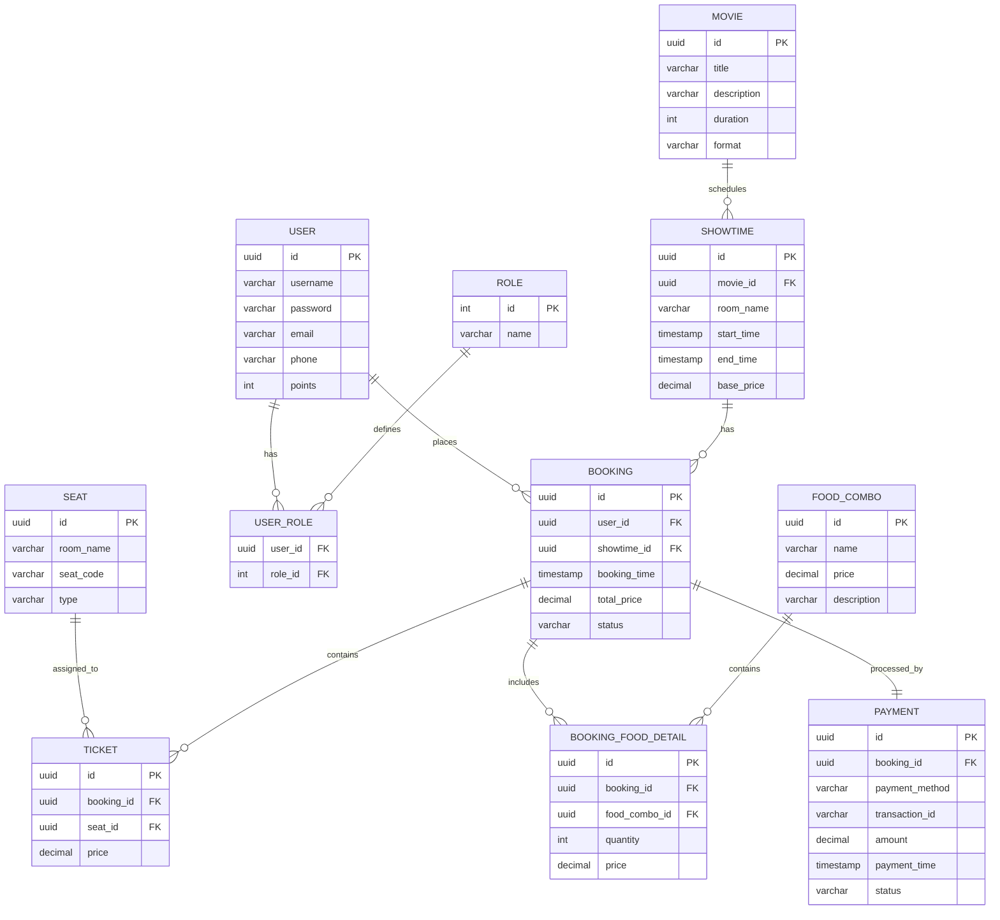

# BÁO CÁO KẾT QUẢ HACKATHON AI - ĐỀ 03

---

## PHẦN 1: TÁI CẤU TRÚC HỆ THỐNG ĐỂ DỄ MỞ RỘNG

### 1. Mục tiêu kỹ thuật
* Áp dụng **Strategy Pattern** nhằm tách biệt hoàn toàn thuật toán tính giá của từng loại ghế (Normal, VIP, Sweetbox). Khi thêm loại ghế mới, ta chỉ cần tạo thêm class Strategy mới mà không làm thay đổi hay ảnh hưởng đến logic tính giá cốt lõi.
* Áp dụng **Strategy kết hợp Registry Pattern** để quản lý mã giảm giá (Student, Festival). Logic áp dụng mã giảm giá được chuyển dịch từ các câu lệnh rẽ nhánh `if-else` lồng nhau phức tạp sang việc đăng ký và tra cứu chiến lược giảm giá linh hoạt trong một Registry.
* Tách biệt cơ chế tích lũy điểm thành viên (`LoyaltyPointsCalculator`) và cơ chế gửi thông báo (`NotificationService`) thành các interface riêng biệt, giúp dễ dàng mở rộng hoặc thay thế phương thức nghiệp vụ trong tương lai.
* Sử dụng **Dependency Injection** để đưa các thành phần phụ thuộc vào `TicketingService`, giảm thiểu liên kết chặt chẽ (tight coupling) và tăng tính bảo trì của hệ thống.
* **Cấu trúc một tệp duy nhất:** Để tuân thủ đúng yêu cầu chỉ giữ lại duy nhất tệp [TicketingService.java](file:///d:/AIApplication/RE12345_NguyenQuangAnh_Hackathon_AI_DE003/src/com.rikkei/refactoring/TicketingService.java) trong thư mục `refactoring`, toàn bộ các interface và class liên quan đều được tích hợp gọn gàng dưới dạng các class phi công khai (non-public classes) trong cùng một file.

### 2. Lịch sử Prompt (Prompt Chain)

* **Prompt 1: Phân tích kiến trúc hiện tại và Đề xuất giải pháp tái cấu trúc**
  ```markdown
  [Role]: Bạn là một Chuyên gia Kiến trúc Phần mềm (Software Architect) có kinh nghiệm dày dặn về thiết kế hệ thống và nguyên lý SOLID.
  [Context]: Tôi có một đoạn mã nguồn Java thực hiện đặt vé xem phim trong class `TicketingService`. Mã nguồn này đang gom chung logic tính giá ghế (Normal, VIP, Sweetbox), áp dụng mã giảm giá, tính điểm loyalty và gửi thông báo vào duy nhất một phương thức `bookTicket`, vi phạm nghiêm trọng nguyên lý Single Responsibility Principle (SRP) và Open/Closed Principle (OCP).
  [Goal]: Hãy phân tích mã nguồn dưới đây và đề xuất phương án tái cấu trúc chi tiết bằng các Design Pattern phù hợp để khi thêm loại ghế mới, mã giảm giá mới, hoặc thay đổi cơ chế thông báo/loyalty, phương thức tính toán cốt lõi sẽ không bị sửa đổi.
  [Constraint]: Hãy giải thích rõ nguyên lý thiết kế và sơ đồ cấu trúc các class đề xuất.
  ```

* **Prompt 2: Hiện thực cơ chế tính giá vé loại ghế bằng Strategy Pattern**
  ```markdown
  [Role]: Bạn là một Java Developer chuyên nghiệp, luôn tuân thủ Clean Code và nguyên lý SOLID.
  [Task]: Hiện thực cơ chế tính giá vé dựa trên loại ghế bằng cách áp dụng Strategy Pattern.
  [Requirements]:
  1. Định nghĩa interface `SeatPricingStrategy` và các concrete class `NormalSeatPricing`, `VipSeatPricing`, `SweetboxSeatPricing`.
  2. Tạo lớp điều phối `SeatPricingService` quản lý danh sách các strategy này để tự động tìm và áp dụng phương thức tính toán phù hợp.
  3. Đảm bảo cấu trúc dễ mở rộng (ví dụ thêm ghế `COUPLE` chỉ cần viết thêm một class mới kế thừa).
  [Output]: Trả về mã nguồn Java sạch kèm giải thích ngắn gọn.
  ```

* **Prompt 3: Hiện thực cơ chế Giảm giá (Strategy + Registry) & Tiện ích bổ sung**
  ```markdown
  [Role]: Bạn là một Java Developer chuyên nghiệp.
  [Task]: Thiết lập cơ chế xử lý mã giảm giá áp dụng Strategy Pattern kết hợp với Registry/Factory Pattern, đồng thời tách biệt cơ chế Loyalty và Notification bằng Interface.
  [Requirements]:
  1. Thiết kế interface `DiscountStrategy` cùng các lớp triển khai `StudentDiscount` (giảm 10%), `FestivalDiscount` (giảm 40k), và `NoDiscount`.
  2. Thiết kế `DiscountRegistry` để đăng ký các mã giảm giá và trả về `DiscountStrategy` tương ứng mà không dùng `if-else` lồng nhau.
  3. Thiết kế interface `LoyaltyPointsCalculator` (mặc định: total/10000) và `NotificationService` (mặc định: push notification).
  [Output]: Cung cấp mã nguồn Java tuân thủ Clean Code.
  ```

* **Prompt 4: Hợp nhất toàn bộ cấu trúc vào một tệp nguồn duy nhất**
  ```markdown
  [Role]: Bạn là một Java Refactoring Expert.
  [Task]: Hợp nhất toàn bộ các interface và class đã tạo ở các bước trước vào duy nhất một tệp tin `TicketingService.java` thuộc package `com.rikkei.refactoring`.
  [Requirements]:
  1. Tệp tin chỉ chứa duy nhất lớp public `TicketingService`. Các interface và helper class/strategy khác phải được khai báo dưới dạng các lớp phi công khai (non-public/package-private) trong cùng tệp tin.
  2. Cung cấp constructor mặc định `public TicketingService()` tự động đăng ký và khởi tạo tất cả các strategy mặc định của đề bài để tương thích ngược hoàn toàn với hệ thống kiểm thử ban đầu (không làm thay đổi cách khởi tạo `new TicketingService()`).
  3. Cung cấp constructor nhận tham số để hỗ trợ Dependency Injection/Unit Testing.
  [Output]: Mã nguồn Java hoàn chỉnh trong tệp `TicketingService.java`.
  ```

### 3. Phân tích lỗi AI
* **Lỗi chưa tối ưu ở lần sinh đầu tiên:**
  Interface `SeatPricingStrategy` ban đầu được đề xuất nhận trực tiếp thực thể `Seat` làm tham số: `double calculatePrice(ShowTime show, Seat seat);`. Điều này tạo ra sự phụ thuộc chặt (tight coupling) giữa Strategy tính giá với lớp Model `Seat`. Nếu sau này lớp `Seat` thay đổi cấu trúc, Strategy tính giá cũng sẽ bị ảnh hưởng và phải chỉnh sửa.
* **Cách khắc phục:**
  Điều chỉnh chữ ký phương thức chỉ nhận giá trị cơ bản: `double calculatePrice(double basePrice);`. Lớp dịch vụ trung gian sẽ chịu trách nhiệm lấy `basePrice` và `type` từ các đối tượng Model để truyền vào Strategy. Điều này giúp các Strategy hoàn toàn độc lập với cấu trúc của `Seat` và `ShowTime`.

---

## PHẦN 2: DEBUGGING BẢO MẬT VÀ XỬ LÝ LỖI HỆ THỐNG

### 1. Mục tiêu kỹ thuật
* Tách biệt cơ chế xử lý lỗi xác thực ở tầng Filter ra khỏi logic nghiệp vụ của bộ lọc JWT bằng cách sử dụng **`AuthenticationEntryPoint`** của Spring Security.
* Đảm bảo mọi ngoại lệ liên quan đến xác thực (như token sai chữ ký, hết hạn, hoặc không đúng định dạng) đều được bắt tập trung và trả về một định dạng JSON đồng nhất: 
  ```json
  {"error": "UNAUTHORIZED", "message": "..."}
  ```
* Thiết lập HTTP Status `401 Unauthorized` thay vì để ngoại lệ lan truyền lên Servlet Container gây lỗi crash `500 Internal Server Error`.

#### Tại sao không nên dùng try-catch và ghi đè response trực tiếp trong Filter?
* **Vi phạm nguyên lý đơn nhiệm (SRP):** Filter sẽ phải kiêm nhiệm cả nhiệm vụ xác thực lẫn định dạng dữ liệu lỗi của response.
* **Trùng lặp mã nguồn:** Nếu ứng dụng sử dụng thêm các Filter xác thực khác, logic bắt ngoại lệ và định dạng JSON lỗi sẽ phải viết lại tại nhiều nơi.
* **Mất tính linh hoạt:** Việc sử dụng cấu hình tập trung qua `AuthenticationEntryPoint` giúp Spring Security dễ dàng thay đổi cấu hình bảo mật hoặc thay đổi định dạng lỗi mà không cần chỉnh sửa mã nguồn hoạt động của từng Filter.

### 2. Lịch sử Prompt (Prompt Chain)

* **Prompt 1: Phân tích lỗi HTTP 500 ở tầng Filter và Luồng Exception**
  ```markdown
  [Role]: Bạn là một Chuyên gia Bảo mật và Phát triển Web với Spring Boot Security.
  [Context]: Lớp bộ lọc `JwtAuthenticationFilter` (kế thừa `OncePerRequestFilter`) của tôi ném ra lỗi `io.jsonwebtoken.security.SignatureException` khi gặp token sai chữ ký. Mặc dù tôi đã cấu hình bộ xử lý ngoại lệ toàn cục `@ControllerAdvice` / `@ExceptionHandler`, server vẫn bị crash và trả về HTTP 500 thay vì HTTP 401 Unauthorized kèm theo JSON lỗi.
  [Question]:
  1. Tại sao ngoại lệ này không được bắt bởi `@ControllerAdvice`? Hãy giải thích luồng đi của request qua Filter Chain và DispatcherServlet.
  2. Làm thế nào để xử lý tập trung tất cả lỗi xác thực tại tầng Filter theo chuẩn của Spring Security để trả về JSON thống nhất dạng `{"error": "UNAUTHORIZED", "message": "..."}`?
  ```

* **Prompt 2: Hiện thực lớp Xử lý lỗi xác thực tập trung**
  ```markdown
  [Role]: Bạn là một Spring Security Developer.
  [Task]: Hiện thực cơ chế xử lý lỗi xác thực tập trung cho JWT.
  [Requirements]:
  1. Viết lớp ngoại lệ tùy chỉnh `JwtAuthenticationException` kế thừa từ `AuthenticationException` của Spring Security.
  2. Viết lớp `JwtAuthenticationEntryPoint` hiện thực `AuthenticationEntryPoint` để bắt lỗi tập trung, thiết lập mã trạng thái HTTP 401 Unauthorized, định dạng header và ghi response JSON thống nhất: `{"error": "UNAUTHORIZED", "message": "..."}`.
  [Output]: Cung cấp mã nguồn Java chi tiết.
  ```

* **Prompt 3: Tích hợp Bộ lọc JWT và Cấu hình SecurityFilterChain**
  ```markdown
  [Role]: Bạn là một Spring Security Integration Expert.
  [Task]: Cập nhật bộ lọc `JwtAuthenticationFilter` để sử dụng `JwtAuthenticationEntryPoint` và cấu hình bộ lọc này vào chuỗi bảo mật.
  [Requirements]:
  1. Trong phương thức `doFilterInternal` của `JwtAuthenticationFilter`, bọc phần giải mã JWT bằng khối `try-catch` để bắt các ngoại lệ của thư viện JJWT (`SignatureException`, `ExpiredJwtException`, `MalformedJwtException`).
  2. Khi bắt được ngoại lệ, ngắt chuỗi Filter và ủy quyền xử lý lỗi cho `JwtAuthenticationEntryPoint`.
  3. Cung cấp lớp cấu hình `SecurityConfig` minh họa việc đăng ký `JwtAuthenticationEntryPoint` và thêm bộ lọc JWT trước `UsernamePasswordAuthenticationFilter` trong `SecurityFilterChain`.
  [Output]: Mã nguồn Java đầy đủ cho `JwtAuthenticationFilter` và `SecurityConfig`.
  ```

### 3. Phân tích lỗi AI
* **Lỗi chưa tối ưu ở lần sinh code đầu tiên:**
  AI đề xuất giải pháp tạo thêm một Filter phụ nằm ngoài cùng chuỗi bộ lọc để bọc toàn bộ Filter Chain bằng khối `try-catch` lớn. Điều này gây dư thừa tài nguyên hệ thống do phát sinh thêm Filter không cần thiết và đi lệch khỏi cơ chế xử lý lỗi xác thực chuẩn có sẵn của Spring Security.
* **Cách khắc phục:**
  Yêu cầu AI loại bỏ Filter bọc ngoài, cấu hình trực tiếp `AuthenticationEntryPoint` vào `HttpSecurity` của chuỗi cấu hình bảo mật `SecurityFilterChain`, đồng thời inject trực tiếp `JwtAuthenticationEntryPoint` vào `JwtAuthenticationFilter` để ủy quyền xử lý lỗi ngay khi bắt được exception.

---

## PHẦN 3: PHÂN TÍCH VÀ THIẾT KẾ HỆ THỐNG VỚI AI

### 1. Nhiệm vụ 1: Đề xuất Giải pháp Công nghệ (Tech Stack)

#### Prompt yêu cầu AI đề xuất Tech Stack:
```markdown
[Role]: Bạn là Chuyên gia Tư vấn Công nghệ (Solution Architect).
[Context]: Khách hàng là chuỗi rạp chiếu phim Rikkei Cinema cần xây dựng nền tảng công nghệ đặt vé xem phim với các nghiệp vụ:
- Phân quyền: Khách hàng, Nhân viên soát vé, Quản lý rạp.
- Tính giá động: Giá gốc theo định dạng phim (2D/3D/IMAX); phụ phí khung giờ vàng (19h-21h) tăng 15%; thứ 3 đồng giá 50k cho vé 2D.
- Combo đồ ăn: Family Combo giảm 10% tổng hóa đơn vé.
- Giữ ghế Real-time: Khi người dùng bấm giữ ghế, trạng thái "Đang giữ" phải đồng bộ tức thời đến màn hình của tất cả người dùng khác.
[Goal]: Đề xuất bộ Tech Stack hoàn chỉnh đáp ứng các yêu cầu trên, đặc biệt tập trung vào giải pháp xử lý Real-time chịu tải cao. Hãy trình bày lý do thuyết phục khách hàng.
[Format]: Cấu trúc rõ ràng theo các tầng: Frontend, Backend, Database (SQL & NoSQL), Real-time Protocol, Infrastructure.
```

#### Tóm tắt giải pháp công nghệ đề xuất:
* **Frontend:** ReactJS hoặc NextJS (sử dụng TypeScript) + TailwindCSS.
  * *Quản lý Real-time:* Sử dụng Socket.io client kết nối WebSockets để trao đổi trạng thái giữ ghế. Quản lý state UI bằng Zustand.
* **Backend:** Spring Boot (Java) hoặc NestJS (Node.js).
  * *Bảo mật & Phân quyền:* Spring Security kết hợp với JWT để phân chia 3 vai trò (Customer, Staff, Manager).
  * *Real-time communication:* Sử dụng Socket.io server / Spring WebSockets (STOMP protocol) để thiết lập luồng kết nối song hướng có độ trễ cực thấp.
* **Database:**
  * *Cơ sở dữ liệu quan hệ (Primary DB):* PostgreSQL làm Database chính đảm bảo tính nhất quán giao dịch (ACID) cho luồng mua vé, đặt ghế và thanh toán.
  * *In-memory Cache (NoSQL):* Redis để lưu trữ phiên giữ ghế tạm thời ("Đang giữ" trong 5-10 phút) thông qua cơ chế TTL (Time-To-Live). Đồng thời Redis làm Message Broker (Pub/Sub) để đồng bộ trạng thái ghế giữa các node backend khi scale.

#### Lý do thuyết phục khách hàng và phản biện của SA:
* **Nhận xét đồng ý (Agree):**
  * **Sử dụng PostgreSQL làm DB chính** là hoàn toàn chính xác. Hệ thống rạp phim yêu cầu tính nhất quán cực cao để tránh lỗi Double Booking (hai khách đặt trùng một ghế). Tính ACID của PostgreSQL sẽ khóa dòng dữ liệu an toàn tại bước thanh toán.
  * **Sử dụng Redis để quản lý trạng thái "Đang giữ"** là giải pháp tối ưu nhất. Khi khách hàng bấm chọn ghế nhưng chưa thanh toán, ghế đó chỉ bị khoá tạm thời. Nếu lưu trạng thái này vào PostgreSQL sẽ gây quá tải ổ đĩa (I/O) và tạo các lock dữ liệu không cần thiết. Redis lưu trên RAM giúp phản hồi real-time nhanh chóng và tự động giải phóng ghế khi hết thời gian giữ (TTL) mà không cần chạy tác vụ quét dọn (cron job) nặng nề trong DB.
  * **Sử dụng WebSockets** thay vì HTTP Polling giúp truyền tải trạng thái ghế lập tức xuống màn hình của toàn bộ khách hàng khác với độ trễ dưới 50ms, tối ưu băng thông server.
* **Nhận xét phản biện & bổ sung (Critique):**
  * *Vấn đề mở rộng kết nối:* Khi rạp phim có lượng truy cập lớn (bom tấn ra mắt), một Server Socket đơn lẻ sẽ bị nghẽn. Tech stack cần bổ sung **Redis Pub/Sub** hoặc **Apache Kafka** để phân phối sự kiện đồng bộ trạng thái ghế giữa các server backend chạy sau Load Balancer.
  * *Distributed Locks:* Tại bước bấm nút Thanh toán cuối cùng, cần áp dụng khóa phân tán **Redisson (Redis Distributed Lock)** để đảm bảo tính duy nhất tuyệt đối ở môi trường phân tán trước khi ghi nhận vào PostgreSQL.

---

### 2. Nhiệm vụ 2: Phân tích Thực thể (Entity Analysis)

#### Prompt yêu cầu AI bóc tách thực thể:
```markdown
[Role]: Bạn là Chuyên gia Thiết kế Cơ sở Dữ liệu (Database Architect).
[Context]: Dựa trên các nghiệp vụ đặt vé, phân quyền, định giá động, combo đồ ăn và thanh toán của rạp chiếu phim Rikkei Cinema.
[Task]: Phân tích và bóc tách các Thực thể (Entities) cốt lõi phục vụ lưu trữ dữ liệu lâu dài.
[Requirements]: Với mỗi thực thể, hãy xác định:
1. Tên thực thể.
2. Các thuộc tính quan trọng kèm kiểu dữ liệu tương ứng.
3. Xác định Khóa chính (Primary Key) và Khóa ngoại (Foreign Key) để thể hiện mối quan hệ.
[Output]: Trình bày danh sách thực thể dưới dạng danh sách phân cấp rõ ràng.
```

#### Danh sách các thực thể (Entities):

1. **USER (Người dùng)**
   * `id` (UUID, PK): Khóa chính.
   * `username` (VARCHAR, Unique): Tên đăng nhập.
   * `password` (VARCHAR): Mật khẩu băm.
   * `email` (VARCHAR): Địa chỉ email.
   * `phone` (VARCHAR): Số điện thoại.
   * `points` (INT): Điểm tích lũy thành viên.

2. **ROLE (Vai trò)**
   * `id` (INT, PK): Khóa chính (1: CUSTOMER, 2: STAFF, 3: MANAGER).
   * `name` (VARCHAR): Tên quyền truy cập.

3. **USER_ROLE (Bảng trung gian phân quyền)**
   * `user_id` (UUID, FK): Khóa ngoại tham chiếu `USER.id`.
   * `role_id` (INT, FK): Khóa ngoại tham chiếu `ROLE.id`.

4. **MOVIE (Phim)**
   * `id` (UUID, PK): Khóa chính.
   * `title` (VARCHAR): Tên phim.
   * `description` (TEXT): Mô tả nội dung.
   * `duration` (INT): Thời lượng phim (phút).
   * `format` (VARCHAR): Định dạng phim (2D, 3D, IMAX).

5. **SHOWTIME (Suất chiếu)**
   * `id` (UUID, PK): Khóa chính.
   * `movie_id` (UUID, FK): Khóa ngoại tham chiếu `MOVIE.id`.
   * `room_name` (VARCHAR): Tên phòng chiếu.
   * `start_time` (TIMESTAMP): Thời gian bắt đầu.
   * `end_time` (TIMESTAMP): Thời gian kết thúc.
   * `base_price` (DECIMAL): Giá vé gốc của suất chiếu.

6. **SEAT (Ghế ngồi trong phòng)**
   * `id` (UUID, PK): Khóa chính.
   * `room_name` (VARCHAR): Tên phòng chiếu.
   * `seat_code` (VARCHAR): Tên ghế (ví dụ: A1, B5).
   * `type` (VARCHAR): Loại ghế (NORMAL, VIP, SWEETBOX).

7. **BOOKING (Đơn đặt vé / Hóa đơn)**
   * `id` (UUID, PK): Khóa chính.
   * `user_id` (UUID, FK): Khóa ngoại tham chiếu `USER.id`.
   * `showtime_id` (UUID, FK): Khóa ngoại tham chiếu `SHOWTIME.id`.
   * `booking_time` (TIMESTAMP): Thời gian lập hóa đơn.
   * `total_price` (DECIMAL): Tổng tiền hóa đơn (sau khi áp dụng giảm giá combo, phụ phí).
   * `status` (VARCHAR): Trạng thái đơn (PENDING, PAID, CANCELLED).

8. **TICKET (Chi tiết vé đặt)**
   * `id` (UUID, PK): Khóa chính.
   * `booking_id` (UUID, FK): Khóa ngoại tham chiếu `BOOKING.id`.
   * `seat_id` (UUID, FK): Khóa ngoại tham chiếu `SEAT.id`.
   * `price` (DECIMAL): Giá cuối của vé này (sau khi tính phụ phí loại ghế/giờ vàng/thứ 3).

9. **FOOD_COMBO (Combo đồ ăn kèm)**
   * `id` (UUID, PK): Khóa chính.
   * `name` (VARCHAR): Tên combo (ví dụ: Family Combo).
   * `price` (DECIMAL): Giá bán combo.
   * `description` (VARCHAR): Chi tiết đồ ăn.

10. **BOOKING_FOOD_DETAIL (Chi tiết đồ ăn đặt kèm)**
    * `id` (UUID, PK): Khóa chính.
    * `booking_id` (UUID, FK): Khóa ngoại tham chiếu `BOOKING.id`.
    * `food_combo_id` (UUID, FK): Khóa ngoại tham chiếu `FOOD_COMBO.id`.
    * `quantity` (INT): Số lượng mua.
    * `price` (DECIMAL): Đơn giá tại thời điểm mua.

11. **PAYMENT (Thanh toán)**
    * `id` (UUID, PK): Khóa chính.
    * `booking_id` (UUID, FK): Khóa ngoại tham chiếu `BOOKING.id`.
    * `payment_method` (VARCHAR): Phương thức (MOMO, VNPAY, CARD).
    * `transaction_id` (VARCHAR): Mã giao dịch nhà cung cấp.
    * `amount` (DECIMAL): Số tiền thanh toán.
    * `payment_time` (TIMESTAMP): Thời gian giao dịch.
    * `status` (VARCHAR): Trạng thái (SUCCESS, FAILED).

---

### 3. Nhiệm vụ 3: Thiết kế Sơ đồ quan hệ thực thể (ERD)

#### Prompt yêu cầu AI viết mã sơ đồ ERD:
```markdown
[Role]: Bạn là một Data Engineer và là chuyên gia về Mermaid.js.
[Task]: Viết mã sơ đồ thực thể mối quan hệ (ERD) bằng Mermaid dựa trên danh sách các thực thể đã chốt của hệ thống đặt vé Rikkei Cinema bao gồm: USER, ROLE, USER_ROLE, MOVIE, SHOWTIME, SEAT, BOOKING, TICKET, FOOD_COMBO, BOOKING_FOOD_DETAIL, PAYMENT.
[Requirements]:
1. Sử dụng đúng cú pháp `erDiagram` của Mermaid.
2. Thể hiện rõ các thuộc tính bên trong thực thể, ký hiệu khóa chính (PK) và khóa ngoại (FK).
3. Sử dụng các ký hiệu quan hệ chuẩn (1-n, 1-1, n-n) và mô tả mối quan hệ bằng động từ rõ ràng.
[Output]: Trả về duy nhất khối mã Mermaid.
```

#### Đoạn mã Mermaid đã dùng để vẽ sơ đồ ERD:


#### Hình ảnh sơ đồ ERD hoàn chỉnh:
Sơ đồ ERD đã được kết xuất ra tệp hình ảnh thực tế chất lượng cao tại: [docs/erd_diagram.png](file:///d:/AIApplication/RE12345_NguyenQuangAnh_Hackathon_AI_DE003/docs/erd_diagram.png)


